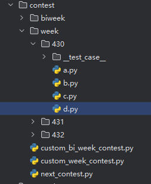

## 这个是干什么的 ？

一个本地模拟力扣周赛的工具，无需处理输入输出，更加方便debug，周赛快人一步 ！


## 效果预览




## 使用文档

### 1、环境变量配置

为了正常直接使用加了一些本地环境变量配置，请在`我的电脑环境变量`配置 `LEETCODE_USERNAME` 这个变量，值随意

这样做的目的是为了直接复制到leetcode不用删除任何地方

### 2、 cookie配置

<h2 style="color:red;">请先配置好cookie!!!</h2>

默认会在这个 [cookie.txt](./cookie.txt) 下生成如果不知道如何配置cookie下面


[vscode使用说明以及cookie获取方式](./use.md)

**当然你也可以选择使用这个工具 [cookie-editor](https://cookie-editor.com/)**


### 3、接口演示

由 [generator.index.py](./generator/index.py) 下面几个接口
 - `create_next_contest` 获取最近的周赛或者双周赛
 - `create_week_contest_by_contest_id` 根据输入指定**序号**拉取对应场次的周赛
 - `create_bi_week_contest_by_contest_id` 根据输入指定**序号**拉取对应场次的双周赛
 - `create_today_question` 自动拉取今天的每日一题 参数为指定目录前缀
 - `parse_problem_by_urls` 输入题目链接自动获取 参数为指定目录前缀


```py


from generator.contest import create_next_contest,create_week_contest_by_contest_id,create_bi_week_contest_by_contest_id


if __name__ == '__main__':
    
    create_next_contest()
    # create_week_contest_by_contest_id()
    # create_bi_week_contest_by_contest_id()

    

```

上面演示在 [contest](./contest) 目录下


### 测试案例

由 [generator.index](./generator/index.py) 提供的包装器 配合上面模板使用即可

```python
def testcase(test=-1, start= 1, end=0x3ffffff, use=True):
    '''
    参数说明
    :param use: 是否启用这个优先级最高默认启用 如果 False 表示这个包装器失效
    :param test:  默认为-1 表示 [start,end] 用例生效 ，如果需要测试某一个用力 直接使用 test=x ，这时 [start,end] 将会失效
    :param start: 在 test 不为 -1 情况下 测试案例从 start 开始
    :param end:   在 test 不为 -1 情况下 测试案例 end 结束
    :return:
    '''
```


### 👓 完整使用模板


下方是一个演示代码，可以直接复制到[这题](https://leetcode.cn/problems/maximum-unique-subarray-sum-after-deletion) 通过


```python
# ------------------------template auto generator---------------------------------------
import os
is_local = os.getenv("LEETCODE_USERNAME") != None
if is_local:
    from generator.index import leetcode_run, ListNode, TreeNode, testcase
    from itertools import *
    import math
    from heapq import heappop, heappush, heapify, heappushpop, heapreplace
    from typing import *
    from collections import Counter, defaultdict, deque
    from bisect import bisect_left, bisect_right
    # from sortedcontainers import SortedList, SortedSet, SortedKeyList, SortedItemsView, SortedKeysView, SortedValuesView
    from functools import cache, cmp_to_key, lru_cache
else:
    def testcase(test=-1, start=1, end=0x3ffffff, use=True):
        def wrapper(f):
            setattr(f, "start", max(1, start))
            setattr(f, "end", max(1, end))
            setattr(f, "use", use)
            setattr(f, "test", test)
            return f

        return wrapper


inf = math.inf
fmax = lambda x, y: x if x > y else y
fmin = lambda x, y: x if x < y else y
MOD = 10 ** 9 + 7


# @access_url: https://leetcode.cn/problems/maximum-unique-subarray-sum-after-deletion

@testcase(test=-1, start=1, end=0x3ffffff, use=True)
class Solution:
    def maxSum(self, nums: List[int]) -> int:
        mx = max(nums)
        if mx <= 0:
            return mx
        return sum(x for x in set(nums) if x >= 0)


if is_local:
    if __name__ == '__main__':
        leetcode_run(
            __class__=Solution, 
            __method__="maxSum", 
            __file__=os.path.join(os.path.dirname(os.path.abspath(__file__)), "__test_case__", "1.txt"),
            __remove_space__=True,
            __unordered__=False,
        )


```

上面模板均自动生成，如果需要指定模板 请访问[这个文件](./generator/generator_template.py) 根据自己喜好修改 


## 3、其他


### 为什么判断字符串题会判断错误 ？

因为解析问题，力扣给的大部分格式都是不规范的，没办法


### 👓 Java 版本

如果使用Java，可以使用[leetcode-template](https://github.com/wuxin0011/leetcode-template-simple)，这个功能更全面【实现了构造类对拍😍]


## Thanks

感谢 [JetBrains](https://www.jetbrains.com/?from=py-lc-run) 提供的 Open Source License

