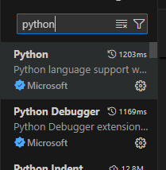
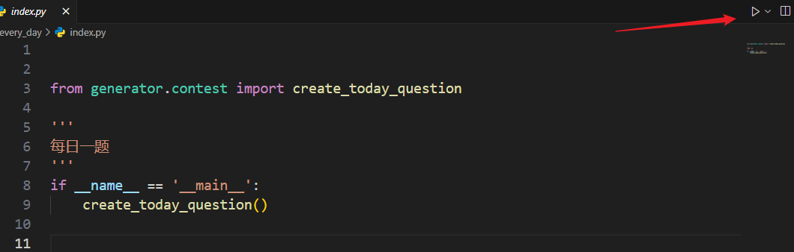
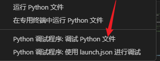
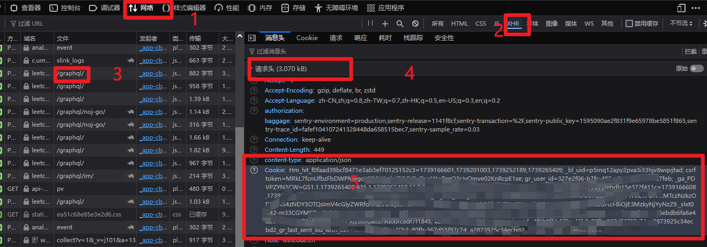

## vscode


### 1 使用前提

创建虚拟环境
```shell
python -m venv venv
```

进入虚拟环境安装依赖
``` shell

# win 环境
venv\Scripts\activate

# mac
venv/Scripts/activate
```

安装依赖
```shell
pip install requests
pip install bs4
pip install lxml
```


### 2 运行

先安装依赖



点击运行，这一步如果提示 cookie安装失败，请配置一下cookie ，参考下面



在必要地方打好断点调式，选择第一个debug方式



## 获取cookie方式 

> 在账号登录情况下获取，参考下面顺序，不要使用其他方式



